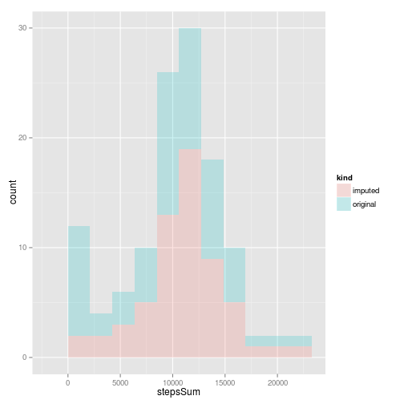
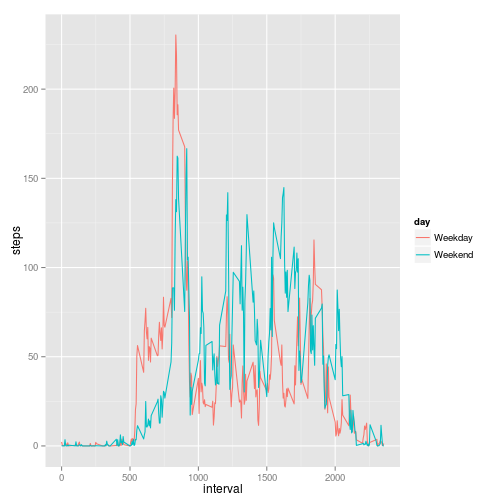

# Reproducible Research: Peer Assessment 1


## Loading and preprocessing the data

```r
data<-read.csv(unz("activity.zip", "activity.csv"))
library(lubridate)
data<-transform(data, date=ymd(date))
```


## What is mean total number of steps taken per day?

```r
library(plyr)
```

```
## 
## Attaching package: 'plyr'
## 
## The following object is masked from 'package:lubridate':
## 
##     here
```

```r
dataPerDay<-ddply(data, .(date), summarize, stepsSum = sum(steps, na.rm=TRUE))
hist(dataPerDay$stepsSum)
```

 

```r
mean(dataPerDay$stepsSum)
```

```
## [1] 9354
```

```r
median(dataPerDay$stepsSum)
```

```
## [1] 10395
```

## What is the average daily activity pattern?

```r
dataPerInterval<-ddply(data, .(interval), summarize, stepsMean = mean(steps, na.rm=TRUE))
plot(x=dataPerInterval$interval, y=dataPerInterval$stepsMean, type = "l")
```

 

## Imputing missing values

```r
sum(is.na(data$steps))
```

```
## [1] 2304
```
We will use the mean of the interval to impute the missing value.


```r
imputedData<-merge(data, dataPerInterval, by="interval")
ind <- which(is.na(imputedData$steps), arr.ind=TRUE)
#substitute NAs with means for the respective interval
imputedData[ind,"steps"]<-imputedData[ind,"stepsMean"]
#remove stepsMean
imputedData<-imputedData[,-c(4)]

imputedDataPerDay<-ddply(imputedData, .(date), summarize, stepsSum = sum(steps, na.rm=TRUE))

#prepare data for visual comparison
imputedDataPerDayComparison<-imputedDataPerDay
imputedDataPerDayComparison$kind<-"imputed"
dataPerDayComparison<-dataPerDay
dataPerDayComparison$kind <-'original'

comparison<-rbind(imputedDataPerDayComparison, dataPerDayComparison)

library(ggplot2)
ggplot(comparison, aes(x=stepsSum, fill = kind)) + 
    geom_histogram(alpha = 0.2,  binwidth = diff(range(comparison$stepsSum))/10)
```

 

```r
c(mean(imputedDataPerDay$stepsSum),mean(dataPerDay$stepsSum))
```

```
## [1] 10766  9354
```

```r
c(median(imputedDataPerDay$stepsSum),median(dataPerDay$stepsSum))
```

```
## [1] 10766 10395
```

## Are there differences in activity patterns between weekdays and weekends?

```r
indWeekend<-which(weekdays(imputedData$date) %in% c('Saturday','Sunday'), arr.ind = TRUE)
imputedData$day<-"Weekday"
imputedData[indWeekend,]$day<-"Weekend"
imputedData$day<-as.factor(imputedData$day)
imputedDataPerInterval<-ddply(imputedData, .(interval, day), summarize, steps = mean(steps))
ggplot(imputedDataPerInterval, aes(x=interval, y=steps, color = day)) + 
    geom_line()
```

 
